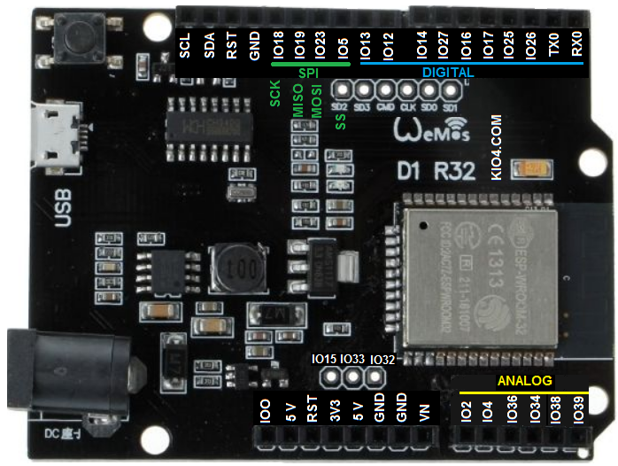
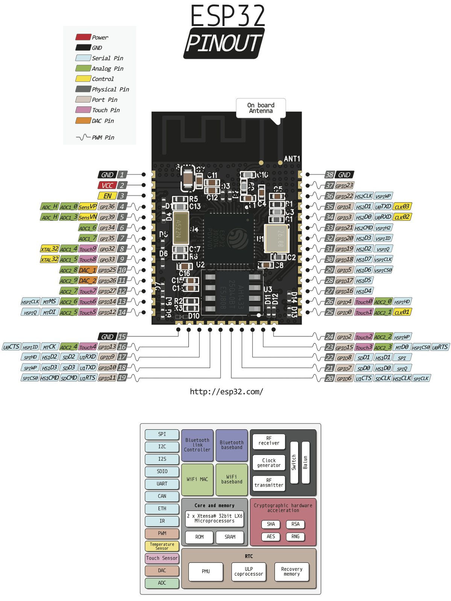

# Wemos-D1-R32-con-Arduino
Programación de la placa Wemos D1 R3 con micro ESP32 mediante el IDE de Arduino

**CARACTERÍSTICAS DE LA PLACA**  
    * Dual core Tensilica Xtensa 32-bit LX6 microprocessor.  
    * Tiene 2 núcleos pero en el IDE de Arduino solo usa uno.  
    * Ultra low power (ULP) co-processor.  
    * Alimentación del chip 2,7 a 3,6V.  
    * Memoria SRAM: 520KB [El máximo utilizable 328KB]  
    * Memoria Flash: 4MB [El máximo utilizable por sketch 1310720]  
    * Alimentación de la tarjeta: 5-12VDC (A veces una pila de 9V no da la suficiente potencia para alimentar al WiFi)  
    * Vin para suministrar alimentación externa de 5VDC-12VDC o toma de tensión de clavija (ver esquema)  
    * WiFi 802.11 b/g/n/e/i (802.11n hasta 150 Mbps) (unos 16 dBm)  
    * Bluetooth v4.2 BR/EDR y BLE.  
    * 6 Entrada analógica (12 bits).  
    * 2 salidas de convertidor DAC (IO25 y IO26)  
    * Frecuencia 160 MHz.  
    * 20 Entradas/Salidas digitales (3.3V) (con funciones PWM, interrupción).  
    * Comunicación UART, SPI, I2C, I2S (bus de stream, para sonido, DMA)  
    * RTOS (Real Time Operating System, Tareas, es como tener varios loop)  
    * 10 sensores de toque.  
    * Tamaño: 68×53 mm  
    * Conexión micro USB.  
    * Corriente: 250mA (max)  
    * Corriente en modo ahorro: 0.015mA  
    * Corriente de funcionamiento: 20mA (sin WiFi)  
    * Los pines GPIO del 34 al 39 son sólo de entrada. (se suelen utilizar como entradas analógicas).  
    * **El diodo de la placa corresponde a la salida IO2 (en la parte de entradas analógicas).**  
    * Sensor_VP y Sensor_VN salida del sensor Hall.  
    * No se recomienda utilizar: SD0, SD1, SD2, SD3, CMD, CL ya que lo utiliza el ESP32 para controlar su memoria Flash.  
    * TXD0, RXD0 se utilizan como UART del USB.  
    * La versión ESP32-WROOM-32U tiene conector de antena.  
 

- Puedes ver más información en https://randomnerdtutorials.com/esp32-pinout-reference-gpios
- Fíjate que el chip tiene 39 terminales, pero se utilizan 38, de ellos 33 son terminales de datos, sin embargo uno de ellos se denomina GPI39, es decir no coincide la numeración de los terminales con el número de terminales.

- ESP: lo fabrica la empresa China Espressif https://www.espressif.com/en/products/hardware/esp-wroom-32/overview

- 32: trabaja con 32 bits.

- W: tiene WiFi

- ROOM: está encapsulado en una cajita metálica con más componentes, ver foto al final de esta página.

  
  
**ENLACES DE INTERÉS**  

  - https://randomnerdtutorials.com/projects-esp32-esp8266-micropython/  
